# ✨ SafeShe

SafeShe is your essential personal safety companion, designed to help women stay safe and connected at all times. With features like live location sharing, SOS alerts, emergency contacts, and safety tips, SafeShe empowers users with the tools needed for a secure environment.

---

## 📱 Screenshots

### 5.1 Main Page (Splash Screen)

### 5.2 Onboarding Pages

* **5.2.1 Onboarding Page 1**
  

* **5.2.2 Onboarding Page 2**
  

* **5.2.3 Onboarding Page 3**
  

### 5.3 Login Page

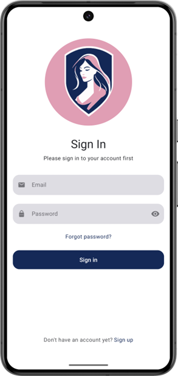

### 5.4 Register Page

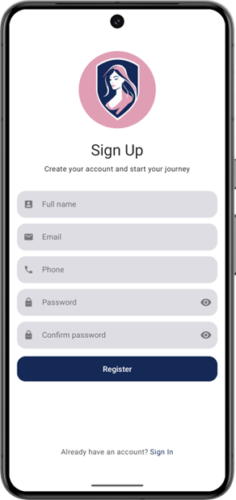

### 5.5 Home Page

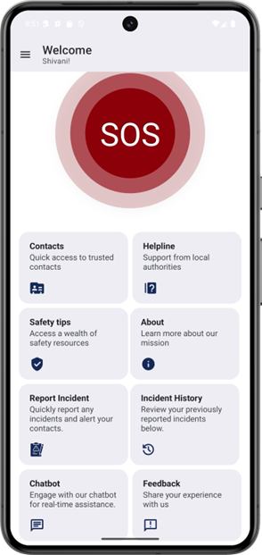

### 5.6 Navigation Drawer Page

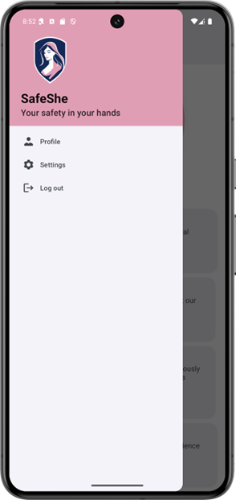

### 5.7 Contact Page

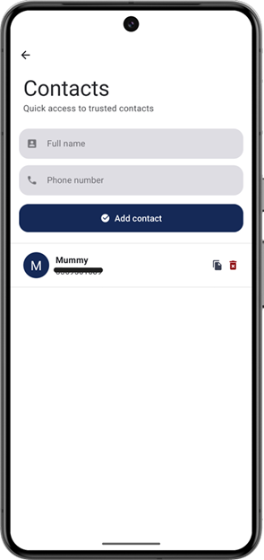

### 5.8 Contact Message Page

### 5.9 Helpline Page

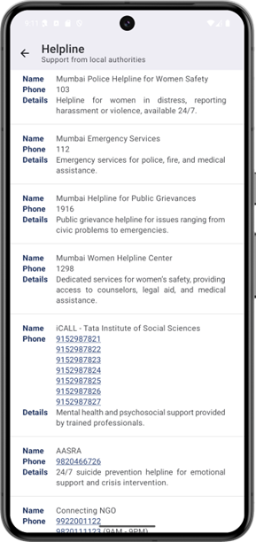

### 5.10 Safety Tips Pages

* **5.10.1 Tip Page**
  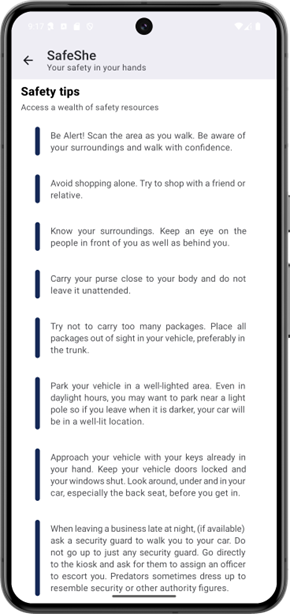

* **5.10.2 Safety Video Page**
  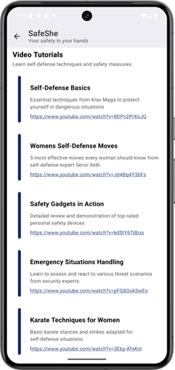

* **5.10.3 Safety Gadgets Page**
  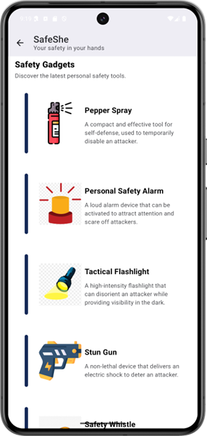

### 5.11 About Page

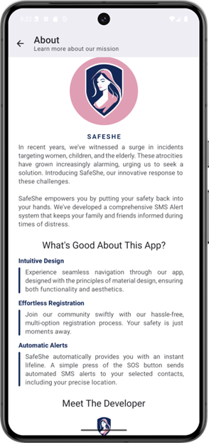

### 5.12 Report Incident Page

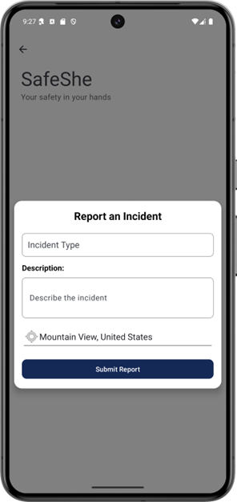

### 5.13 Incident History Page

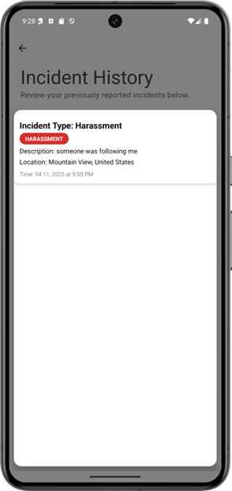

### 5.14 Chatbot Page

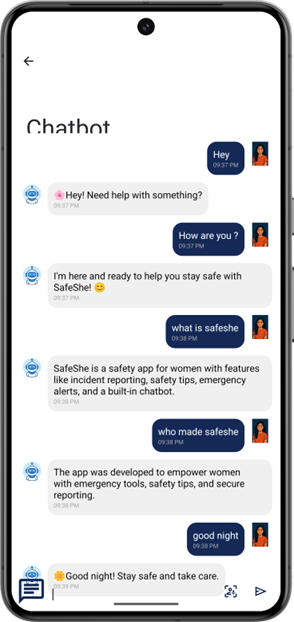

### 5.15 Feedback Page

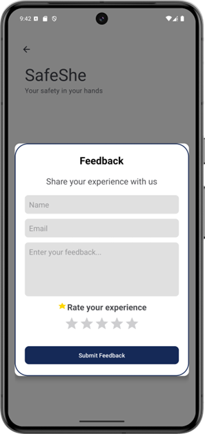

### 5.16 Profile Page

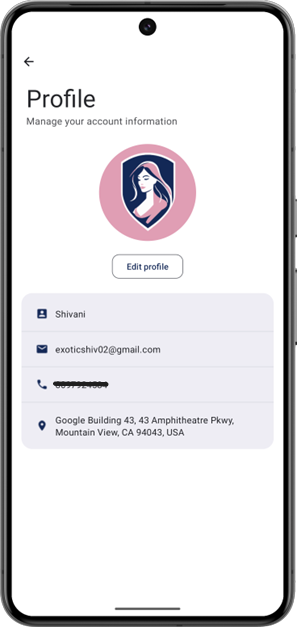

### 5.17 Edit Profile Page

### 5.18 Settings Page

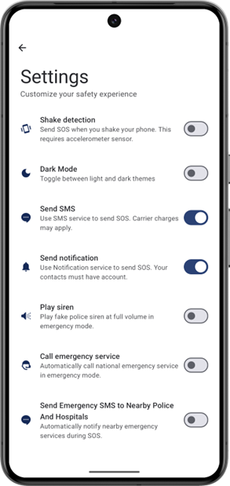

---

## 🔥 Features

### 👤 User Management

* **Login and Registration**: Easy access for users.

### 🛡️ Safety Measures

* **Live Location Sharing**: Instantly share your location with trusted contacts.
* **Trusted Contacts**: Add up to 10 trusted contacts.
* **User Notifications**: Alert trusted contacts via notifications.
* **SMS Notifications**: Notify non-app users via SMS.

### 🚨 Emergency Assistance

* **Emergency Helplines**: Access important helpline numbers.
* **Safety Tips**: Learn how to stay safe through curated tips.

### 🆘 SOS Mode

* **Shake Detection**: Trigger SOS with a simple shake gesture.
* **Audible Alert**: Loud siren to draw attention.
* **Emergency Call**: Auto-call emergency services in SOS mode.

---

## 🗼 Architecture

This app uses Firebase services (Authentication, Realtime Database, Firestore).

---

## 🧰 Build Tool

To build this project, use **Android Studio Giraffe or above**.

---

## 🚀 Getting Started

1. In Android Studio: Tools > Firebase > Authentication > Authenticate using a custom authentication system.
2. Connect to Firebase.
3. Add Firebase Authentication SDK.
4. In Firebase Console > Authentication > Sign-in method:

   * Enable Email/Password.
   * Do not enable Email Link.
5. In Firebase Console > Settings > Service accounts:

   * Generate new private key.
   * Rename to `service_account.json` and place in `res/raw/`.
6. In `NotificationAPI.java`, paste your `project_id` from `service_account.json`.

You're good to go!

---

## 📩 Contact

Feel free to connect:

* **Email**: [your-email@example.com](mailto:khushivish0210@gmail.com)

---

## 🤝 Credits

* [icons8.com](https://icons8.com/) for providing high-quality app icons.

---
